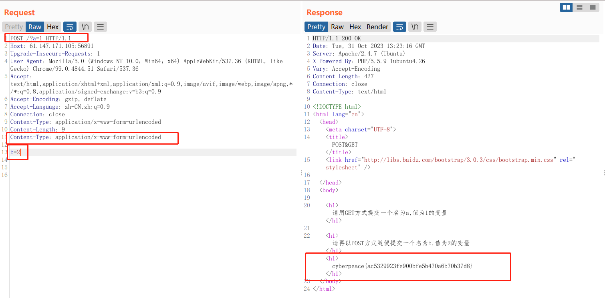

# GET_POST

HTTP的 get post 请求

---

brupsuit 提交



brupsuit 提交 get和 post 请求
```http request
POST /?a=1 HTTP/1.1   // 修改 GET 为 POST
Host: 61.147.171.105:56891
Upgrade-Insecure-Requests: 1
User-Agent: Mozilla/5.0 (Windows NT 10.0; Win64; x64) AppleWebKit/537.36 (KHTML, like Gecko) Chrome/99.0.4844.51 Safari/537.36
Accept: text/html,application/xhtml+xml,application/xml;q=0.9,image/avif,image/webp,image/apng,*/*;q=0.8,application/signed-exchange;v=b3;q=0.9
Accept-Encoding: gzip, deflate
Accept-Language: zh-CN,zh;q=0.9
Connection: close
Content-Type: application/x-www-form-urlencoded
Content-Length: 9
Content-Type: application/x-www-form-urlencoded    //  POST请求必须添加

b=2   // 需空一行  多个参数用 & 连接
```

```
cyberpeace{ac5329923fe900bfe5b470a6b70b37d8}
```