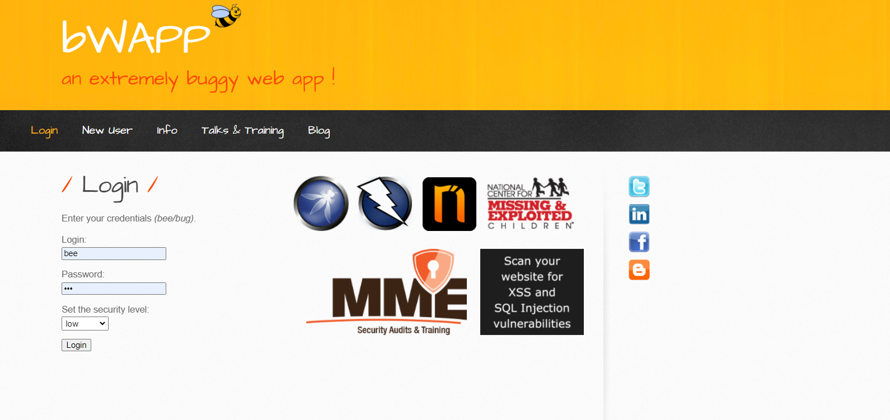

# bwapp 靶场环境 wsl docker 安装

## wsl docker-desktop
微软商店安装 ubuntu， 

docker官网 安装 docker-desktop
```
wsl -l -v  # 查看虚拟机状态

wsl -d Ubuntu  # 启动虚拟机

wsl -t ubuntu # 停止

wsl --shutdown  # 全部停止

# 迁移
wsl --export Ubuntu D:\WSL\ubuntu.tar # 迁移出 C盘

wsl --unregister Ubuntu  # 卸载

wsl --import Ubuntu D:\WSL\ D:\WSL\ubuntu.tar --version 2  # import到D盘

```
## bwapp安装
启动docker-desktop
```
docker search bwapp

docker pull raesene/bwapp

docker run --name bwapp -d -p 9999:80 8be28fba48ec  # 靶场环境 无需挂载

 # http://localhost:9999/install.php 
 初始化
 用户名 bee
 密码   bug

docker exec -it bwapp /bin/bash

```
