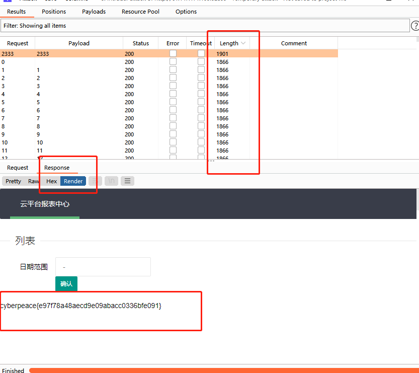

## ics-06
云平台报表中心收集了设备管理基础服务的数据，但是数据被删除了，只有一处留下了入侵者的痕迹。

---

题目 “报表中心” “只有一处” 是关键提示
* 报表中心url为
```
http://61.147.171.105:52833/index.php?id=1
```
报表中心 更换 id 可以访问。 所以尝试对id 爆破

---
Brupsuit

proxy -> open browser (intercept is on) 对报表中心url  抓包

* ctrl+r send调试 ctrl+i 添加payload
* set number  id 1-5000爆破 得到flag


